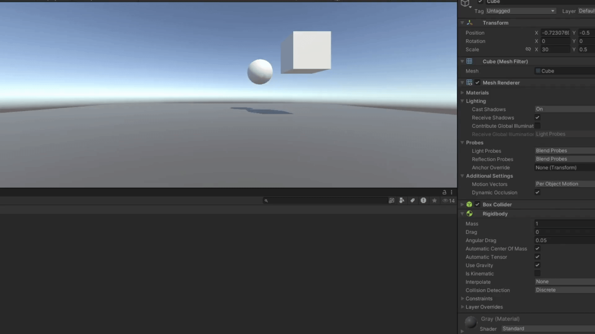
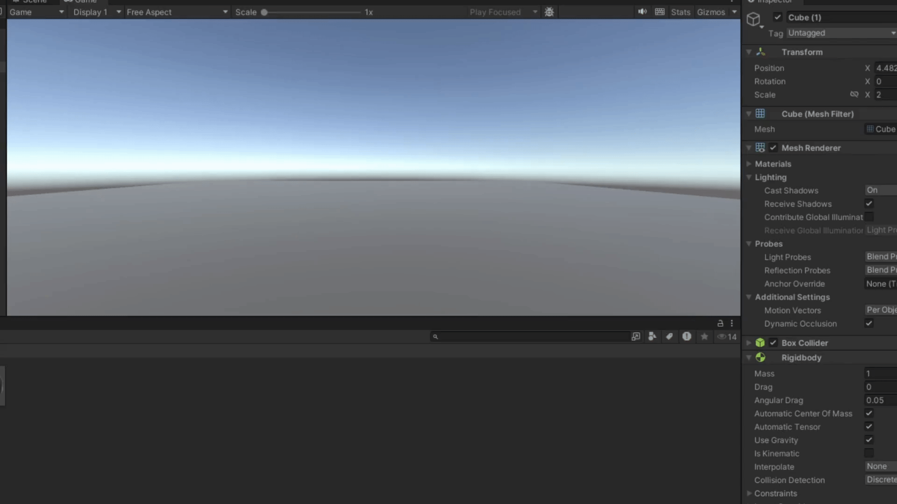
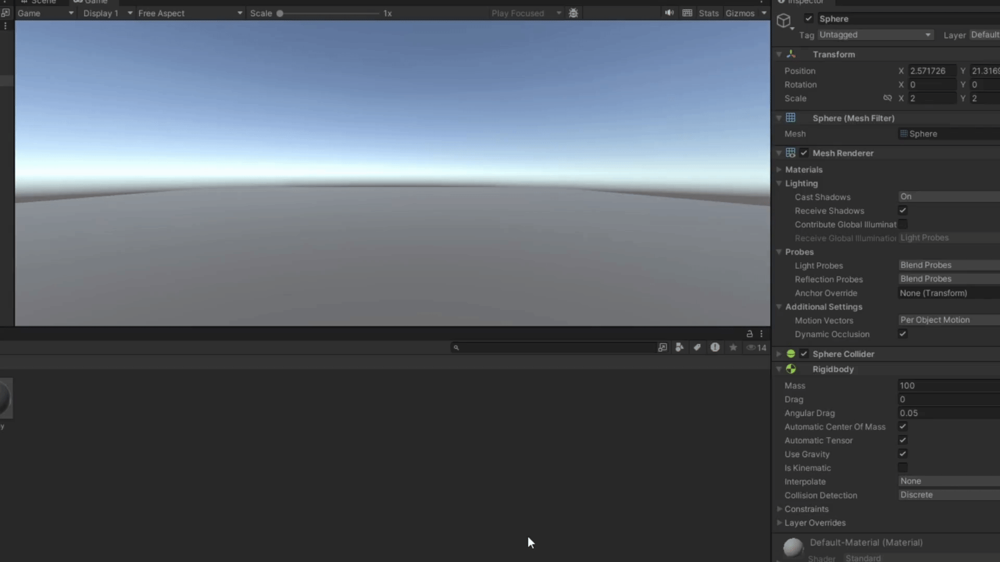
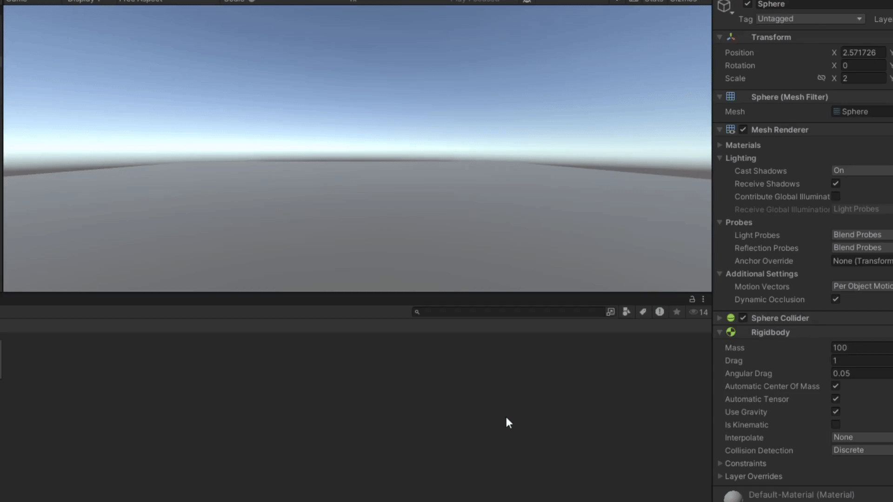
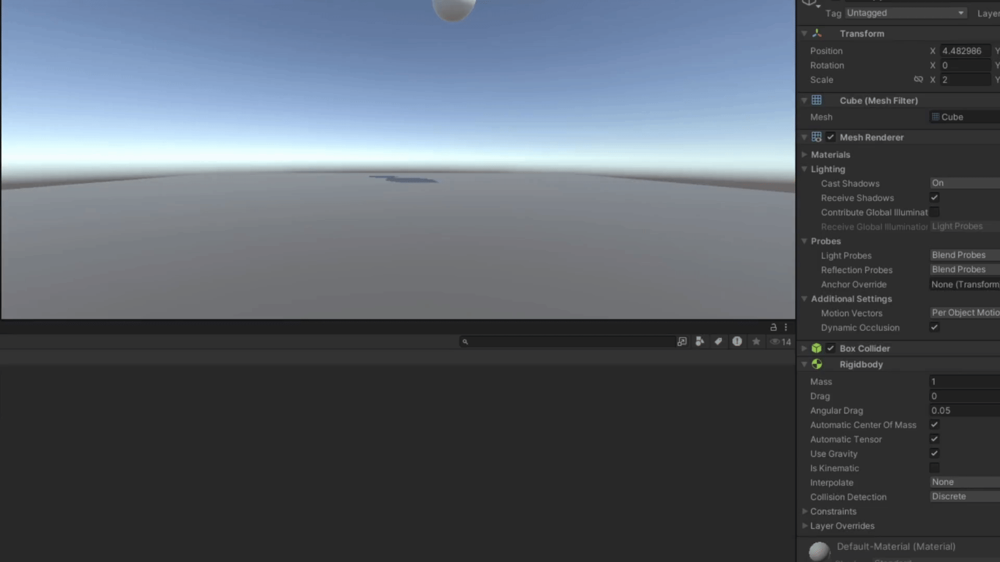
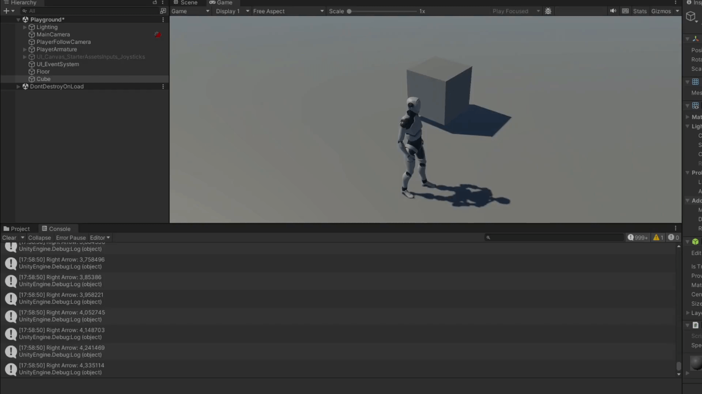
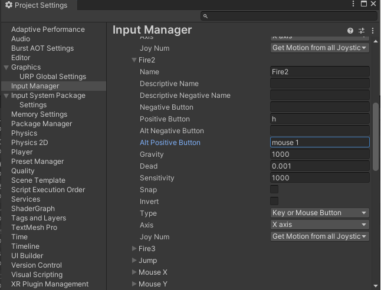

# Práctica 3 Interfaces Inteligentes
## Adrián Suárez Tabares

## Ejercicio Físicas

### 1

### 2

### 3

### 4

### 5

### 6

### 7

### 8

### 9

## Ejercicios
### 1 Notificar cuando se pulsen las teclas

### 2 Poner a h como la acción de disparar

### 3 Trasladar el cubo
- a) Al duplicar los valores de las dimensiones del vector no parece haber cambio a simple vista  
- b) Al duplicar la velociadad el cubo irá el doble de rápido
- c) Si la velocidad es negativa, el cubo se mueve el la dirección opuesta al vector de dirección
- d) Si y > 0, el cubo cae hasta llegar al suelo 
- e) El vector de dirección ahora es relativo a su sistema de referencia por lo que cambiaría su dirección si ambos sistemas no coinciden.

### 4 y 5 Mover los objetos con las teclas

### 6 Moverse hacia la esfera

### 7 Mirar hacia la esfera

### 8 Girae sobre el eje horizonatal

### 9-11 Colisiones

### 12 Experimentos con el cilindro
El cilindro tiene 10 veces más masa que la esfera y la arrastra fácilmente

El cilindro tiene 10 veces menos masa que la esfera y no la mueve nada

Al añadir fricción a la esfera, al cilindro le cuensta más arrastrarla

Cuando la esfera es un trigger, pierde su colisión

Si la esferá es cinemática, el cilindro no la podrá mover por mucha fuerza que haga

